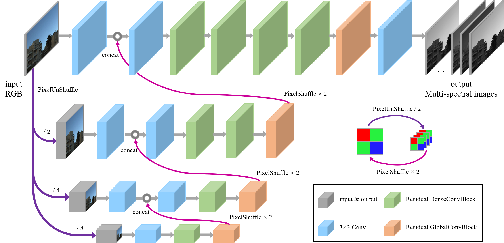
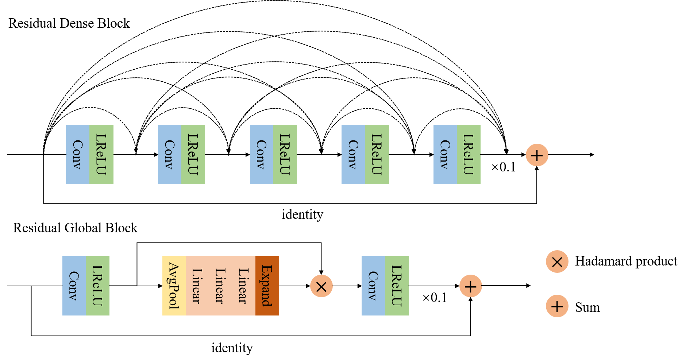
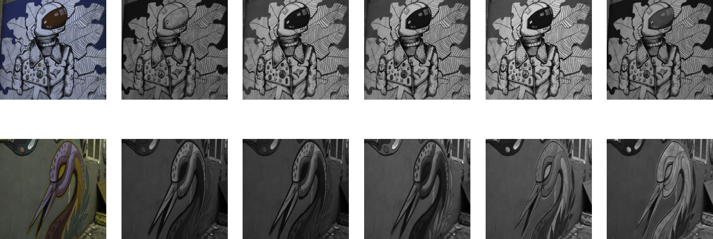

# Hierarchical Regression Network for Spectral Reconstruction from RGB Images

The README file for NTIRE 2020 Spectral Reconstruction Challenge of Team OrangeCat: Hierarchical Regression Network for Spectral Reconstruction from RGB Images

## File structure

```
NTIRE 2020 Spectral Reconstruction Challenge
│   README.md
│   validation*.py
│   test*.py
│   ensemble*.py
│
└───track1 (saving the trained models of track1)
│   │   code1_G_epoch9000_bs8.pth
│   │   code1_second_G_epoch8000_bs8.pth
│   │   ...
│
└───track2 (saving the trained models of track2)
│   │   code1_bs2_G_epoch6000_bs2.pth
│   │   code2_G_epoch6000_bs8.pth
│   │   ...
|
└───NTIRE2020_Test_Clean
│    │   ARAD_HS_0468_clean.mat
│    │   ARAD_HS_0508_clean.mat
│    │   ...
│
└───NTIRE2020_Test_RealWorld
│    │   ARAD_HS_0477_RealWorld.mat
│    │   ARAD_HS_0502_RealWorld.mat
│    │   ...
│
└───test (will generate by test1.py or test2.py)
│   └───track1
│       │   ARAD_HS_0468_clean.mat
│       │   ARAD_HS_0508_clean.mat
│       │   ...
│   └───track2
│       │   ARAD_HS_0477_RealWorld.mat
│       │   ARAD_HS_0502_RealWorld.mat
│       │   ...
│
└───ensemble (will generate by ensemble1.py or ensemble2.py)
│   └───track1
│       │   ARAD_HS_0468_clean.mat
│       │   ARAD_HS_0508_clean.mat
│       │   ...
│   └───track2
│       │   ARAD_HS_0477_RealWorld.mat
│       │   ARAD_HS_0502_RealWorld.mat
│       │   ...
│   
```

## Requirements
* Python 3.6
* Pytorch 1.0.0
* Cuda 8.0

## Network architecture

The main network:


The blocks used in main network:


## Train
* Run `train.py`.
* Change `baseroot` that contains training data.
* Change `save_path` corresponding to track 1 or track 2.
* Change other parameters.

## Test

Note that the data should be first generated from different models (please run `test*.py`). Then compute the average of all results by running `ensemble_track*_8methods.py`. Finally, all the results for both tracks are saved in `./ensemble/track1` and `./ensemble/track2`.

### track 1 generation
* Run `test1.py`.
* It will output 8 results of 8 networks.
### track 1 ensemble
* Run `ensemble_track1_8methods.py`.
* It will output 1 ensemble result of 8 generated data.
### track 2 generation
* Run `test2.py`.
* It will output 8 results of 8 networks.
### track 2 ensemble
* Run `ensemble_track2_8methods.py`.
* It will output 1 ensemble result of 8 generated data.

For each track, we use the "best" epoch for ensemble:


## Visualize
* Run `train_visualize.py` or `validation_visualize.py` or `test_visualize.py`.

An example is like this:


## Link to pre-trained models and testing results
* Pre-trained models: [OneDrive link](https://portland-my.sharepoint.com/:f:/g/personal/yzzhao2-c_ad_cityu_edu_hk/Em_8mi1dNLRKkaq2_lXsv8MBZbpuQ_IayEYs1OZe1fLx8A?e=b1T6UI). After downloading it, please put them to right folders.
* Testing results: [OneDrive link](https://portland-my.sharepoint.com/:f:/g/personal/yzzhao2-c_ad_cityu_edu_hk/Emuplm0cx1FFurDAjSuIs00Bx_qr2d4erDFfvN_nDxeThg?e=hM5nqA)
